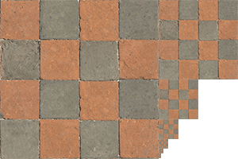

[TOC]

# 一、纹理基础

纹理材质的反光性质

- 各项异性：固定视角和光源方向旋转表面时，反射会发生任何改变
- 各项同性：固定视角和光源方向旋转表面时，反射不会发生任何改变


纹理映射坐标

- 所有的纹理尺寸都会映射在 [0, 1] 的范围
- OpenGL、Unity 纹理坐标原点在 左下角
- DirectX 纹理坐标原点在 左上角


纹理的尺寸

- 长宽大小应该是 2 的幂
  非 2 的幂的纹理会占用更多的内存空间和读取时间，有些平台会不支持非 2 的幂尺寸的纹理
- 纹理可以是非正方形的


## 1. 纹理环绕（坐标包装）

> 当**纹理坐标超出默认范围**时，每种纹理环绕方式都有不同的视觉效果输出

OpenGL 设置纹理不同坐标轴的环绕方式

```c
glTexParameteri(GL_TEXTURE_2D, GL_TEXTURE_WRAP_S, GL_NEAREST); //纹理坐标 s/u/x 轴的包装格式
glTexParameteri(GL_TEXTURE_2D, GL_TEXTURE_WRAP_T, GL_LINEAR);  //纹理坐标 t/v/y 轴的包装格式
```


| 环绕方式           | 描述                                                         |
| ------------------ | ------------------------------------------------------------ |
| GL_REPEAT          | 对纹理的默认行为，重复纹理图像                               |
| GL_MIRRORED_REPEAT | 和 GL_REPEAT 一样，但每次重复图片是镜像放置的                |
| GL_CLAMP_TO_EDGE   | 纹理坐标会被约束在 0 ～ 1之间，超出的部分会重复纹理坐标的边缘，产生一种边缘被拉伸的效果 |
| GL_CLAMP_TO_BORDER | 超出的坐标处的纹理为用户指定的边缘颜色                       |


## 2. 纹理过滤（采样）

> 当三维空间里面的多边形，变成二维屏幕上的一组像素的时候，对每个像素需要到相应纹理图像中进行采样，这个过程就称为纹理过滤 

纹理过滤的两种情况

- 纹理被缩小 `GL_TEXTURE_MIN_FILTER`：一个像素对应多个纹理单元
  例，一个 8 X 8 的纹理贴到远处正方形上，最后在屏幕上占了 2 X 2 个像素矩阵
- 纹理被放大 `GL_TEXTURE_MAG_FILTER`：一个纹理单元对应多个像素
  例，一个 2 X 2 的纹理贴到近处正方形上，最后在屏幕上占了 8 X 8 个像素矩阵


OpenGL 中针对放大和缩小的情况的设置

```c
glTexParameteri(GL_TEXTURE_2D, GL_TEXTURE_MIN_FILTER, GL_NEAREST); //缩小
glTexParameteri(GL_TEXTURE_2D, GL_TEXTURE_MAG_FILTER, GL_LINEAR);  //放大
```


### 2.1 最近点采样 GL_NEAREST

优点：效率最高
缺点：效果最差

方法：选择最接近中心点纹理坐标的 **1 个纹理单元**采样


### 2.2 双线性过滤 GL_LINEAR

优点：适于处理有一定精深的静态影像
缺点：不适用于绘制动态的物体，当三维物体很小时会产生深度赝样锯齿 (Depth Aliasing artifacts)

方法：选择最接近中心点纹理坐标的 2 X 2 纹理单元矩阵进行采样，取 **4 个纹理单元**采样的平均值


### 2.3 三线性过滤 GL_LINEAR_MIPMAP_LINEAR

> 多级渐远纹理 (Mipmap) 
> 效率高但是会占用一定的空间
> 一系列的纹理图像，后一个纹理图像是前一个的二分之一。距观察者的距离超过一定的阈值，OpenGL会使用不同的多级渐远纹理，即最适合物体的距离的那个。由于距离远，解析度不高也不会被用户注意到。
>
> 一张方形地板的多级渐远纹理如下图
>
> 

优点：效果最好，适用于动态物体或景深很大的场景
缺点：效率低，只能用于纹理被缩小的情况

方法：

1. 取 Mipmap 纹理中距离与当前屏幕上尺寸相近的两个纹理

2. 将 1 中选取的纹理 选择最接近中心点纹理坐标的 2 X 2 纹理单元矩阵进行采样（线性过滤）

3. 将 2 中两次采样的结果进行加权平均（**8 个纹理单元**采样），得到最后的采样数据


### 2.4 各向异性过滤

> 之前提到的三种过滤方式，默认纹理在 x，y 轴方向上的缩放程度是一致的
> 当纹理在 3D 场景中，出现一个轴的方向纹理放大，一个轴的方向纹理缩小的情况（**OpenGL 判定为纹理缩小**）需要使用各向异性过滤配合以上三种过滤方式来达到最佳的效果

优点：效果最好，使画面更加逼真
缺点：效率最低，由硬件实现

方法：

1. 确定 X、Y 方向的采样比例
   ScaleX = 纹理的宽 / 屏幕上显示的纹理的宽
   ScaleY = 纹理的高 / 屏幕上显示的纹理的高
   异向程度 = max(ScaleX, ScaleY) / min(ScaleX, ScaleY);

   例，64 X 64的纹理最后投影到屏幕上占了128 X 32 的像素矩阵
   ScaleX = 64.0 / 128.0 = 0.5;
   ScaleY = 64.0 / 32.0 = 2.0;
   异向程度 = 2.0 / 0.5 = 4;

2. 根据采样比例分别在 X、Y 方向上采用 *三线性过滤* 或 *双线性过滤* 获得采样数据，**采样的范围由异向程度决定，不是原来的 2 X 2 像素矩阵**

   例，64 X 64的纹理最后投影到屏幕上占了128 X 32 的像素矩阵
   异向程度为 4，且在 缩放方面 X 轴 > Y 轴，所以 X 轴采样 2 个像素，Y 轴采样 2 * 异向程度 = 8 个像素
   采样范围为最接近中心点纹理坐标的 2 X 8 的像素矩阵


OpenGL 中设置各向异性过滤

```c
glTexParameterf(GL_TEXTURE_2D, GL_TEXTURE_MAX_ANISOTROPY_EXT, 异向程度);
```

各向异性对比三线性


# 二、凹凸映射 bump mapping

## 1. 高度纹理 height map

高度纹理：使用一张高度纹理来模拟表面上下高度的位移，然后得到修改后的法线值

- 优点：非常直观，可以从高度纹理中明确的知道一个模型表面的凹凸情况
- 缺点：计算较复杂，不能直接得到表面法线，需要通过像素的灰度值计算得到


## 2. 法线纹理 normal map

法线纹理

- 直接存储表面法线
- 根据法线所在的坐标空间类型可分为
  模型空间的法线纹理 (object-space normal map)：将修改后的**模型**空间表面的法线存储在一张纹理中
  切线空间的法线纹理 (tangent-space normal map)：将修改后的**纹理**切线空间表面的法线存储在一张纹理中
  **一般使用切线空间的法线纹理**


法线的模型变换矩阵

- 在顶点坐标的模型变换中，当我们使用一个不等比缩放时，法线不会再垂直于对应的表面
  

- 法线需要一个基于顶点坐标的模型变换的专门的 模型矩阵
  如果模型变换 $M_t$ 不是正交变换，则法线变换矩阵为：$M_{n} = (M_t^T)^{-1}$
  如果模型变换 $M_t$ 是正交变换，则法线变换矩阵为：$M_{n} = M_t$
  正交变换：旋转变换，[公式的推导过程](../LinearAlgebra/Part1_Matrix.md)
  由于位移对于法线方向没有影响，而逆变换计算量较大，因此一般采用没有位移的 3 X 3 矩阵来计算法线变换


### 2.1 使用流程

**1. CPU**

   1. 由 模型变换 得到 法线的模型变换矩阵（逆矩阵耗时大，尽量放在 CPU 上算一次）
   2. 根据顶点位置和纹理坐标信息，计算**模型空间下的** 切线 和 副切线
   3. 每三个顶点构成一个平面，他们共享一组 切线 和 副切线


**2. 顶点着色器**

  1. 将顶点数据中的 切线、副切线、法线坐标系位置经过 法线的模型变换矩阵 转换为
    **世界空间下的** 切线空间坐标，归一化后构建 切线空间矩阵
  2. 计算世界空间下的光源在 切线空间 的坐标


**3. 片元着色器**

   1. 根据法线纹理对应的普通纹理的纹理坐标，从法线纹理读取切线空间下的法线数据（像素值）
   2. 将范围是 [0, 1] 的像素值，转换为范围是 [-1, 1] 的表面法线值：$normal = pixel*2.0 - 1.0$
   3. 将在**切线空间**下的光源和物体片元的坐标与法线计算得到片元颜色


### 2.2 切线空间

切线空间的坐标系
虽然实际在模型上进行纹理贴图时，实际的纹理坐标在贴图后并不一定互相垂直（非刚体变换），但这不会改变法线的方向

- 原点：模型的顶点
- Z 轴：N（Normal）法线方向（和 Z 轴的正方向始终保持一直）
- X 轴：T（Tagent）切线方向，和纹理坐标的 X 轴（U）一致
- Y 轴：B（Bitangent）副切线方向 ，和纹理坐标的 Y 轴（V）一致


计算映射 **模型空间** 到纹理法线 **切线空间** 的矩阵

- 已知切线空间法线纹理的切线 T 和 副切线 B 分别对应与法线纹理对应普通纹理的 U 和 V 坐标轴
  （此时 T、B 在模型空间下）且点 $P_1$、$P_2$、$P_3$ 与纹理坐标的对应关系如下图，
  求切线方向 T 和副切线方向 B

  

- 则：
  $$
  \begin{align}
  E_1 &= \Delta U_1 T + \Delta V_1 B\\
  E_2 &= \Delta U_2 T + \Delta V_2 B\\
  \begin{bmatrix} E_1\\ E_2 \end{bmatrix}
  &= 
  \begin{bmatrix}
  \Delta U_1 & \Delta V_1\\
  \Delta U_2 & \Delta V_2
  \end{bmatrix}
  \begin{bmatrix} T\\ B \end{bmatrix} \\
  \begin{bmatrix}
  \Delta U_1 & \Delta V_1\\
  \Delta U_2 & \Delta V_2
  \end{bmatrix}^{-1}
  \begin{bmatrix} E_1\\ E_2 \end{bmatrix}
  &= 
  \begin{bmatrix} T\\ B \end{bmatrix} \\
  {1 \over \Delta U_1 \Delta V_2 - \Delta U_2 \Delta V_1}
  \begin{bmatrix}
  \Delta V_2 & -\Delta V_1\\
  -\Delta U_2 & \Delta U_1
  \end{bmatrix}
  \begin{bmatrix} E_1\\ E_2 \end{bmatrix}
  &= 
  \begin{bmatrix} T\\ B \end{bmatrix} \\
  {1 \over \Delta U_1 \Delta V_2 - \Delta U_2 \Delta V_1}
  \begin{bmatrix}
  \Delta V_2 E_1 -\Delta V_1 E_2\\
  -\Delta U_2 E_1 + \Delta U_1 E_2
  \end{bmatrix}
  &= 
  \begin{bmatrix} T\\ B \end{bmatrix}
  \end{align}
  $$
  


### 2.3 不同坐标空间的比较

模型空间法线纹理的优点：

- 实现简单，更加直观
- 在纹理坐标的缝合处和尖锐的边角部分，可见的突变（缝隙）较少，边界过渡平滑
  模型空间的法线纹理存储的是同一坐标系下的法线信息，在边界可将法线通过插值，来实现平滑过渡
  切线空间的法线依靠纹理坐标的方向得到的结果，会在边缘处或尖锐的地方出现缝合现象


切线空间法线纹理的优点：

- 自由度高，可做 UV 纹理动画
  可映射到不同的网格上，而模型空间法线纹理只能用于创建他的网格
- 可以复用法线纹理
  一个砖块的 6 个面可以共用一张切线空间法线纹理
- 对于纹理使用的额外数据是 可压缩的
  可只存储额外的 切线 和 副切线 2 个方向，而模型空间的法线必须存储 3 个方向的值


## 3. 渐变纹理

- 为了控制物体在不同强度光线下颜色的过渡
- 渐进纹理多为一种 颜色查找表([LookUp Table](https://zhuanlan.zhihu.com/p/43241990))：将一种颜色映射为另一种颜色
  下图为 256 * 1 像素的渐进纹理和其对应的效果


## 4. 遮罩纹理

- 保护纹理的某些区域，使它们免于修改
- 主要用与控制光照，使同一个纹理的模型不同的角度拥有了不同的高光强度
- 一般为单通道纹理，不过有时候一张 RGBA 四通道的遮罩纹理可以控制 四种 表面属性的强度
- 使用方式为：物体的颜色 = 当前纹理坐标对应的遮罩纹理强度 * 光照计算后的颜色


# 三、高级纹理

## 1. 立方体纹理


## 2. 渲染纹理


## 3. 程序纹理

### 3.1 规则的程序纹理


### 3.2 噪声纹理


# 引用

1. [Render To Texture](http://www.paulsprojects.net/opengl/rtotex/rtotex.html)
2. [learnopengl-基础光照](https://learnopengl-cn.github.io/02 Lighting/02 Basic Lighting/)
3. [learnopengl-法线贴图](https://learnopengl-cn.github.io/05%20Advanced%20Lighting/04%20Normal%20Mapping/)
4. [Unity_Shaders_Book : https://github.com/candycat1992/Unity_Shaders_Book](https://link.zhihu.com/?target=https%3A//github.com/candycat1992/Unity_Shaders_Book)
5. [Unity Manual: https://docs.unity3d.com/Manual/TextureTypes.html](https://link.zhihu.com/?target=https%3A//docs.unity3d.com/Manual/TextureTypes.html)


# 草稿、Tessellation 曲面细分

Tessellation（曲面细分，可选阶段）：
当 Tessellation 阶段存在时，只能给管线提供 GL_PATCHES 类型的图元
当 Tessellation 阶段不存在时，不能提供 GL_PATCHES 类型的图元

- Tessellation Control Shader（TCS，细分控制着色器）
- Tessellation Primitive Generation（细分图元生成）
- Tessellation Evaluation Shader（TES，细分求值着色器）