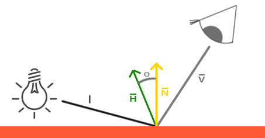
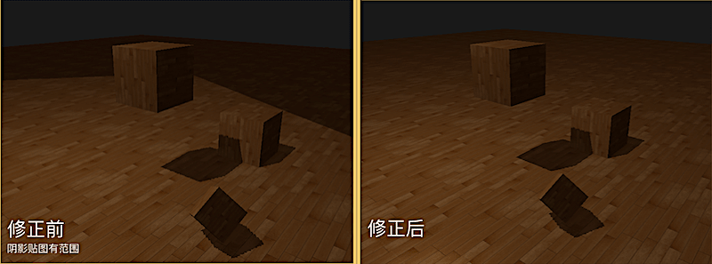
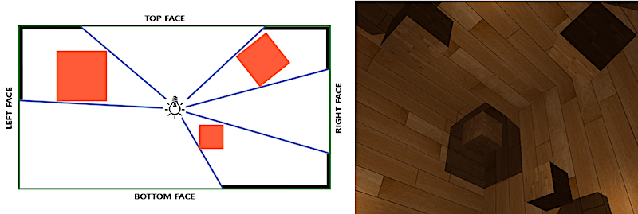

[TOC]

# 一、光学描述

## 1. 光源

光源的方向：$l$ 表示

光的量化：辐照度（irradiance）

- 平行光的辐照度：垂直与光线方向 $l$ 的 **单位面积** 上 **单位时间** 内穿过的能量
  可以粗略的理解为 平行光的辐照度 = ${能量 \over {d \over \cos \theta}} = {能量 \over d}\cos \theta$
  
  

## 2. 光的吸收和散射

光线与物体相交产生吸收和散射现象

散射（scattering）：只改变光的方向，不改变光的密度和颜色

- 反射（reflection）：光散射到物体外部 [ 形成 **高光反射** specular ]
- 折射（refraction）/ 透射（transmission）：光散射到与其相交物体的内部
  折射后的光线会继续在物体内部散射，最终 [ 形成 **漫反射**  diffuse ]
  1. 一部分光线被物体吸收（absorption）
  2. 一部分光线从物体表面被发射出去（这些光线和入射光线有不通的方向分布和颜色）

出射度（exitance）：出射光线的数量和方向

材质的漫反射和高光反射属性：辐射度 和 出射度 的比值（辐射度 和 出射度 满足线性关系）

## 3. BRDF 光照模型

**着色（shading）**：计算某个观察方向出射度的过程，期间需要材质属性、光源信息 和 一个等式（这个等式也称为光照模型）

**BRDF（Bidirectional Reflectance Distribution Function）光照模型**：描述光线从某个方向照射到一个表面时，有多少光线被反射？反射的方向有哪些？图形学中，大多数使用一个数学公式来描述，并提供一些参数来调整材质属性

# 二、光照模型

> 基础光照模型是对 BRDF 光照模型进行简化和理想化后的经验模型

## 1. 基础知识

常用的计算光照的方法：

- **物体反射的颜色（我们感知到的颜色）：光源的颜色 * 物体的颜色**
- 多光源的情况下，一般都是将各个光源的颜色累加起来，最后得出最终的颜色
- 同一个光源的光衰减系数是一样的，因此 **最终颜色 = 光衰减系数 * 光照模型计算的颜色**

## 2. Phong 光照模型（标准光照模型）

> Phong 着色：使用 Phong 光照模型，在**片元着色器**逐像素的计算（使用的顶点法线在当前片面的插值）
> Gouraud 着色：使用 Phong 光照模型，在**顶点着色器**逐顶点的计算（计算量相对较小）

Phong 照模型只关心由光源发射，经过物体表面一次反射后**进入摄像机的光线**
$$
Phong \space 光照模型 = 环境光 + 自发光 + 漫反射 + 高光反射
$$

- **环境光 Ambient**：间接光照（indirect light）经过多个物体之间反射的光照
  是一个全局光照，同一个场景中的所有物体都使用同样的环境光（一般为常量）

- **自发光 Emissive**：直接由光源发射的光照，一般为材质的颜色
  实时渲染中自发光不会作为光源来照亮其他物体

- **漫反射 Diffuse**：物体表面随机散射后反射的光照
  
  **兰伯特光照模型**（物体背面的光照不会参与着色计算）
  
  反射的光线强度 与 表面法线和光源方向夹角 的余弦值 成正比
  
  由于 两个单位向量的点积 $\hat n \cdot I = |\hat n||I| \cos \theta = \cos \theta$
  所以 反射的光线强度 和 **单位**表面法线和**单位**光源方向 的点积 成正比
  其中，max 函数防止出现表面法线 $n$ 和 光源方向 $I$ 夹角 $\theta$ 大于 90 度的情况（即，光源被物体遮挡的情况）
  
  
$$
Color_{diff} = Color_{light} \cdot Color_{材质强度} \max(0, n \cdot I)
$$

​		**半兰伯特光照模型**（物体背面的光照会参与着色计算）基于兰伯特光照模型
​		不通过限制余弦值的大小而是将余弦值的范围从 [-1, 1] 映射到 [0, 1]
​		采用半兰伯特光照模型的漫反射颜色计算公式为
$$
Color_{diff} = Color_{light} \cdot Color_{材质强度} (0.5 + 0.5* n \cdot I)
$$

- **高光反射 Specular**：
  
  
  
  **计算反射方向** $r$，已知法线 $\hat n$ 是单位向量，$L$ 是入射光线 $I$ 到 $\hat n$ 的投影
  $$
\begin{align}
  |\hat n| &= 1 \\ \\
  r + I &= 2 L\\
  &= 2(|I|cos \theta) \\
  &= 2(|\hat n||I|cos \theta) \\
  &= 2(\hat n\cdot I) \\
  r &= 2 (\hat n \cdot I) \hat n - I
  \end{align}
  $$
  
  
  **高光反射**，已知 观察方向 $\hat v$ 是单位向量
  
  
  $$
  Color_{spec} = Color_{light} \cdot Color_{高光强度} \max(0, \hat v \cdot r)^{Gloss}
  $$
  Gloss：光泽度，控制高光区域的亮点（光泽度越大，亮点越小）
  
  max 函数防止出现 $v$ 和 $r$ 夹角 $\theta$ 大于 90 度的情况（即，光源在摄像头后侧的情况）
  

## 3. Blinn-Phong 光照模型

$$
Blinn-Phong \space 光照模型 = 环境光 + 自发光 + 漫反射 + 高光反射
$$

与 Phong 光照模型相似，Blinn-Phong 在 高光反射 的计算上有不同的实现

**Phong 光照的缺点**：

当物体的反光度非常小时，它产生的镜面高光半径足以让相反方向的光线对亮度产生足够大的影响。在这种情况下就不能忽略它们对镜面光分量的贡献了

Blinn-Phong 光照模型为了解决 Phong 光照的上述缺点，**计算高光强度的方法改为**计算 **半程向量** 与 法线向量 的夹角的方式

$$
\hat h = {I + \hat v \over |I + \hat v|}
$$
Blinn-Phong 的高光强度
$$
Color_{spec} = Color_{light} \cdot Color_{高光强度} \max(0, \hat h \cdot \hat n)^{Gloss}
$$

Blinn-Phong 较 Phong 具有更真实的光照效果

## 4. Fresnel reflection 菲涅耳反射

菲涅耳反射：观察方向和物体表面法线的夹角越大，反射效果越明显

应用：菲涅耳反射计算的强度系数 * 噪声纹理 **可以表现出水波的效果**

近似公式，其中 $v$ 表示视角方向，$n$ 表示物体表面法线

- Schlick 菲涅耳近似公式 $F_{schlick}(v,n) = F_0 + (1-F_0)(1-v \cdot n)^5$
- Empricial 菲涅耳近似公式 $F_{empricial}(v,n) = max(0,min(1, bias + scale * (1- v \cdot n)^{power}))$
  其中 bias，scale，power 是控制项

## 5. 基于物理的光照模型

限于篇幅问题，这里只列参考文章：

- [Unity Shader: 基于物理的渲染](./EXT2_UnityShadersChapter18.pdf)

# 三、光源类型

光源类型，即投光物(Light Caster)：将光**投射**(Cast)到物体的光源

## 1. 平行光 Directional light

平行光，又称定向光：光源处于无限远处，所有光线有相同的方向

- 不考虑光源位置，只考虑光的方向
- 表示用方向：平行光从光源发出的方向
- 计算用方向：平行光从片段发出到光源的方向（与平行光的表示相反）

## 2. 点光源 Point light

点光源：光源处于世界中某一个位置的光源，它会朝着所有方向发光，但光线会随着距离逐渐衰减

- 计算用方向：平行光从片段发出到点光源的方向
- 衰减系数：点光源的最终结果需要乘以一个衰减系数

**光的衰减**

衰减(Attenuation)：随着光线传播距离的增长逐渐削减光的强度

光的衰减的模拟公式（其中 $K_c$、$K_l$、$K_q$ 的取值都是经验值）

- $K_c$ 通常保持为 1.0，它的主要作用是保证分母永远不会比1小，否则的话在某些距离上它反而会增加强度，这肯定不是我们想要的效果
- $K_l$ 与距离值相乘，以线性的方式减少强度
- $K_q$ 与距离的平方相乘，让光源以二次递减的方式减少强度。二次项在距离比较小的时候影响会比一次项小很多，但当距离值比较大的时候它就会比一次项更大了

$$
L_{att} = {1.0 \over K_c + K_l * d + K_q * d^2}
$$

实际的光的衰减的计算

1. 通过一张 256 * 1 的纹理作为查找表
   通过的**点到光源距离的平方** 来（为了避免开方操作）查找衰减值（Unity 内的光衰减纹理）
2. 使用简化后的数学公式计算衰减（Unity 内使用的计算公式）

$$
L_{att} = {1.0 \over D_{光源到着色物体的距离}}
$$

## 3. 聚光 Spot light

聚光：只朝一个特定方向而不是所有方向照射光线，只有在聚光方向的特定半径内的物体才会被照亮，其它的物体都会保持黑暗

- LightDir：聚光照射到片元的方向

- SpotDir：聚光的方向

- $\phi$ 切光角：聚光的照在物体上光圈的半径大小

- $\theta$ LightDir 和 SpotDir 之间的夹角

**聚光的边缘软化**

- 聚光边缘强度变化：需要一个内切光角和一个外切光角，通过从内到外切光角的过渡来表示聚光强度的变化

- 强度计算公式，其中
$I$ 为聚光强度，范围是 [0, 1] 
$\theta$ 为 LightDir 和 SpotDir 之间的夹角
$\phi$ 为外切光角，$\gamma$ 为内切光角（$\phi$、$\gamma$ 一般作为聚光的属性，都是常数）

  $I = {\theta - \phi \over cos\gamma - cos\phi}$

## 4. 面光源 Area light

> 由于面光源会同时从几个不同的方向照亮对象，因此阴影比其他类型的光更柔和细微
> 可用于创建逼真的路灯或靠近播放器的一排灯
>
> 小面积的光源可以模拟较小的光源（例如室内照明），比点光源具有更逼真的效果

面光源：由空间中的矩形限定，在所有方向上均匀地在其表面区域上发出光，但仅从矩形的一侧发出

# 四、渲染路径 Rendering Path

渲染路径：决定光照如何应用到 shader 中，是当前渲染目标使用光照的流程

## 1. 前向渲染 Forward

前向渲染路径（Unity 默认渲染路径）

- 方法：对场景中的每个物体进行着色，在 VS 或 FS 对 每个光源逐个进行计算（世界坐标系）
- 缺点：光源数量越多，计算越复杂
- 适合场景：光源较少的场景，室外
- 优化：有些作用程度特别小的光源可以不进行考虑（Unity 中只考虑重要程度最大的前 4 个光源）

## 2. 延迟渲染 Deferred

延迟渲染

- 方法：将光照处理这一步放在三维物体已经生成二维图片之后进行处理（屏幕坐标系）
  1. 几何阶段：渲染所有 几何/颜色 到 G-Buffer（Geometry Buffer）
     G-Buffer：用来存储每个像素对应的 Position，Normal，Diffuse Color 和其他 Material parameters（所有变量都在**世界坐标系**下）
     
     > 此时，已经剔除了许多 3D 场景中的数据，只剩下少量由几何 mesh 组成的片元信息
     >
     > 通过 多渲染目标(Multiple Render Targets, MRT)技术，可以一此渲染完成对像素 位置、颜色、法线等对象信息到多个帧缓冲里
  2. 光照处理阶段：使用 G-buffer 计算场景的光照渲染
  
- 缺点：
  
  1. 虽然复杂度不虽光源数目的增加而产生巨大变化，但是随着场景的复杂增加 G-Buffer 会越来越大，增幅也是不能忽视的，而且存取 G-Buffer 耗费的带宽也是不能忽视的
  2. 不支持真正的抗锯齿功能
  3. 不能处理半透明物体（G buffer 只有最前面的片段信息）
  4. 对显卡有一定要求（Shader Mode 3.0 及以上）
  
- 适合场景：室内

- 优化：

  1. 光体积
     光源能够达到片段的范围（通过光的衰减计算出光的半径）
     一般通过渲染光的衰减半径的球体来确定光源的影响范围

     根据衰减公式可知，衰减值只能无限接近于 0，因此需要通过选定一个衰减的最小值来限定光的范围
     一般 $L_{att} = {x \over 256}$，除以 256 是因为默认的 8-bit 帧缓冲可以每个分量显示这么多强度值
     $$
     \begin{align}
     L_{att} &= {1.0 \over K_c + K_l * d + K_q * d^2}\\
     K_q * d^2 + K_l * d + K_c &= {1.0 \over L_{att}}\\
     K_q * d^2 + K_l * d + K_c - {1.0 \over L_{att}} &= 0\\
     d &= {-K_l + \sqrt{K_l^2 - 4*K_q*(K_c - {1.0 \over L_{att}})} \over 2 * K_q}
     \end{align}
     $$
     
2. Light Pre-Pass、Tile-Based Deferred Rendering、Forward+

# 五、 阴影

## 1. 阴影映射 Shadow Mapping

方法：

1. 渲染深度贴图（阴影贴图）
   以光的位置为视角进行渲染，我们能看到的东西都将被点亮，看不见的是阴影
2. 渲染场景
   根据生成的深度贴图，通过将当前视角的坐标变换为深度贴图的坐标（光源头空间坐标）来计算片段是否在阴影之中

重点：

1. 获取阴影贴图的值为透视投影下的非线性深度值

   **解决方案**：将非线性深度值通过透视投影的逆变换转换为线性深度，[投影矩阵](../LinearAlgebra/Part1_Matrix.md)
   $$
   \begin{align}
   Z_n &= {{far + near} \over {far - near}} +{2 \cdot far \cdot near \over {far - near}}{1 \over Z_{linear}} \\
   (far - near)Z_n &= (far + near) + 2 \cdot far \cdot near {1 \over Z_{linear}} \\
   {(far - near)Z_n - (far + near) \over 2 \cdot far \cdot near} &= {1 \over Z_{linear}} \\
   Z_{linear} &= {2 \cdot far \cdot near \over (far - near)Z_n - (far + near)}
   \end{align}
   $$
   
2. 阴影贴图有一定的范围，无法覆盖所有场景

   

   **解决方案**：让阴影贴图范围外的没有阴影
   <u>边缘超出阴影贴图</u>：将阴影贴图的纹理环绕选项设置为 GL_CLAMP_TO_BORDER，给边框设一个较亮的白色
   <u>深度 Z 超出阴影贴图裁剪范围</u>：将在光源空间坐标下深度大于 1 的阴影去掉

   

3. 阴影贴图受限于分辨率，画出的阴影有锯齿感

   

   **解决方案**：PCF（percentage-closer filtering）
   计算阴影时，多次进行深度图的采样计算，给做一次均值滤波，来模糊阴影边缘的锯齿

   

4. 在**距离光源比较远**时，多个片段会从深度贴图的同一个值中采样
   当光以一定角度朝向物体表面时，物体表面会产生明显的线条样式

   

   **解决方案**：阴影偏移（shadow bias）
   根据对阴影贴图应用一个**根据物体表面朝向和光线的角度**变化的偏移量

   

   这样会带来一个问题 —— 悬浮

   

   解决悬浮的一种方法：通过在生成阴影深度贴图时采用正面剔除的方式，只保留实体物体阴影深度，地板的深度会去掉

## 2. 级联式纹理映射 Cascaded Shadow Map（CSM）

## 3. 点光源阴影 Point Shadows

点光阴影，过去的名字是万向阴影贴图（omnidirectional shadow maps）技术

方法：

1. 渲染深度**立方体**贴图
2. 渲染场景

## 4. 透明物体的阴影

## 5. 屏幕空间的环境光遮挡 SSAO

屏幕空间的环境光遮挡 （Screen Space Ambient Occlusion，SSAO）通过将褶皱、孔洞和非常靠近的墙面变暗的方法近似模拟出间接光照（如，下图）

方法：在三维物体已经生成二维图片之后计算遮蔽因子

1. 几何阶段：渲染当前相机范围的 顶点、法线、深度 到 G-Buffer（Geometry Buffer）
   注意：纹理采样使用 clamp_to_edge 方法，防止采样到在屏幕空间中纹理默认坐标区域之外的深度值
2. 光照处理阶段：计算遮蔽因子
   1. 计算法向半球采样位置
      在切线空间内，距离每个顶点一定范围内（半球形范围，法向量 0.0 ~ 1.0）随机取固定数量的像素值
      一般会将采样点靠近原点（每个顶点）分布
   2. 创建随机核心转动噪声纹理
      创建一个小的随机旋转向量纹理(4X4)平铺在屏幕上（对场景中每一个片段创建一个随机旋转向量，会占用大量内存）
   3. 检测深度范围
      检测深度如果在法向半球采样半径内，则被保留，作为影响遮蔽因子的因素
   4. 比较深度
      法向半球检测的采样深度如果大于观察视角的深度，则作为影响遮蔽因子的因素
   5. 模糊环境遮蔽结果
      重复的噪声纹理再上一步的图中清晰可见，为了创建一个光滑的环境遮蔽结果，需要用 box bluer 来模糊环境遮蔽纹理
   6. 应用在光照计算中
      光照模型中的环境光 = 原来的环境光常量 * 遮蔽因子（环境遮蔽纹理中）

# 引用

- [learnopengl-Lighting Advanced](https://learnopengl-cn.github.io/05 Advanced Lighting/01 Advanced Lighting/)
- [learnopengl-Light casters](https://learnopengl-cn.github.io/02%20Lighting/05%20Light%20casters/)
- [learnopengl-Deferred Shading](https://learnopengl-cn.github.io/05 Advanced Lighting/08 Deferred Shading/)
- [learnopengl-ShadowMapping](https://learnopengl-cn.github.io/05 Advanced Lighting/03 Shadows/01 Shadow Mapping/)
- [learnopengl-Point Shadows](https://learnopengl-cn.github.io/05 Advanced Lighting/03 Shadows/02 Point Shadows/)
- [learnopengl-SSAO](https://learnopengl-cn.github.io/05 Advanced Lighting/09 SSAO/)
- [Everything has Fresnel](http://filmicworlds.com/blog/everything-has-fresnel/)
- [Unity_Shaders_Book](https://github.com/candycat1992/Unity_Shaders_Book)
- [实时渲染中常用的几种 Rendering Path](https://www.cnblogs.com/polobymulberry/p/5126892.html)
- [OGL-Cascaded Shadow Mapping](http://ogldev.atspace.co.uk/www/tutorial49/tutorial49.html)
- [MSDN-Cascaded Shadow Maps](https://docs.microsoft.com/zh-cn/windows/win32/dxtecharts/cascaded-shadow-maps?redirectedfrom=MSDN)

