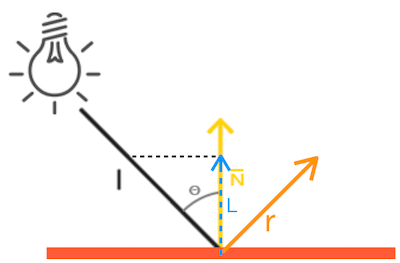
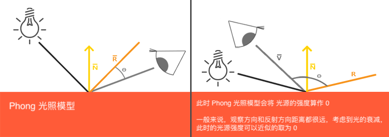

[TOC]

# 一、光学描述

## 1. 光源

光源的方向：$l$ 表示

光的量化：辐照度（irradiance）

- 平行光的辐照度：垂直与光线方向 $l$ 的 **单位面积** 上 **单位时间** 内穿过的能量
  可以粗略的理解为 平行光的辐照度 = ${能量 \over {d \over \cos \theta}} = {能量 \over d}\cos \theta$
  
  

## 2. 光的吸收和散射

光线与物体相交产生吸收和散射现象

散射（absorption）：只改变光的方向，不改变光的密度和颜色

- 反射（reflection）：光散射到物体外部 [ 形成 **高光反射** specular ]
- 折射（refraction）/ 透射（transmission）：光散射到与其相交物体的内部
  折射后的光线会继续在物体内部散射，最终 [ 形成 **漫反射**  diffuse ]
  1. 一部分光线被物体吸收（scattering）
  2. 一部分光线从物体表面被发射出去（这些光线和入射光线有不通的方向分布和颜色）

出射度（exitance）：出射光线的数量和方向

材质的漫反射和高光反射属性：辐射度 和 出射度 的比值（辐射度 和 出射度 满足线性关系）

## 3. 光的衰减

衰减(Attenuation)：随着光线传播距离的增长逐渐削减光的强度

光的衰减的模拟公式（其中 $K_c$、$K_l$、$K_q$ 的取值都是经验值）

- $K_c$ 通常保持为 1.0，它的主要作用是保证分母永远不会比1小，否则的话在某些距离上它反而会增加强度，这肯定不是我们想要的效果
- $K_l$ 与距离值相乘，以线性的方式减少强度
- $K_q$ 与距离的平方相乘，让光源以二次递减的方式减少强度。二次项在距离比较小的时候影响会比一次项小很多，但当距离值比较大的时候它就会比一次项更大了

$$
L_{att} = {1.0 \over K_c + K_l * d + K_q * d^2}
$$

实际的光的衰减的计算会简化为（Unity 内使用的计算公式）
$$
L_{att} = {1.0 \over D_{光源到着色物体的距离}}
$$

## 4. BRDF 光照模型

**着色（shading）**：计算某个观察方向出射度的过程，期间需要材质属性、光源信息 和 一个等式（这个等式也称为光照模型）

**BRDF（Bidirectional Reflectance Distribution Function）光照模型**：描述光线从某个方向照射到一个表面时，有多少光线被反射？反射的方向有哪些？图形学中，大多数使用一个数学公式来描述，并提供一些参数来调整材质属性

# 二、光照模型

> 基础光照模型是对 BRDF 光照模型进行简化和理想化后的经验模型

## 1. 基础知识

常用的计算光照的方法：

- **物体反射的颜色（我们感知到的颜色）：光源的颜色 * 物体的颜色**
- 多光源的情况下，一般都是将各个光源的颜色累加起来，最后得出最终的颜色
- 同一个光源的光衰减系数是一样的，因此 **最终颜色 = 光衰减系数 * 光照模型计算的颜色**

## 2. Phong 光照模型（标准光照模型）

> Phong 着色：使用 Phong 光照模型，在**片元着色器**逐像素的计算（使用的顶点法线在当前片面的插值）
> Gouraud 着色：使用 Phong 光照模型，在**顶点着色器**逐顶点的计算（计算量相对较小）

Phong 照模型只关心由光源发射，经过物体表面一次反射后**进入摄像机的光线**
$$
Phong \space 光照模型 = 环境光 + 自发光 + 漫反射 + 高光反射
$$

- **环境光 Ambient**：间接光照（indirect light）经过多个物体之间反射的光照
  是一个全局光照，同一个场景中的所有物体都使用同样的环境光

- **自发光 Emissive**：直接由光源发射的光照，一般为材质的颜色
  实时渲染中自发光不会作为光源来照亮其他物体

- **漫反射 Diffuse**：物体表面随机散射后反射的光照，符合 Lambert's Law 
  反射的光线强度 与 表面法线和光源方向夹角 的余弦值 成正比
  由于 两个单位向量的点积 $\hat n \cdot I = |\hat n||I| \cos \theta = \cos \theta$
  所以 反射的光线强度 和 **单位**表面法线和**单位**光源方向 的点积 成正比
  
  
$$
  Color_{diff} = Color_{light} \cdot Color_{材质强度} \max(0, n \cdot I)
$$
  其中，max 函数防止出现表面法线 $n$ 和 光源方向 $I$ 夹角 $\theta$ 大于 90 度的情况（即，光源被物体遮挡的情况）

  

- **高光反射 Specular**：
  
  
  
  **计算反射方向** $r$，已知法线 $\hat n$ 是单位向量，$L$ 是入射光线 $I$ 到 $\hat n$ 的投影
  $$
\begin{align}
  |\hat n| &= 1 \\ \\
  r + I &= 2 L\\
  &= 2(|I|cos \theta) \\
  &= 2(|\hat n||I|cos \theta) \\
  &= 2(\hat n\cdot I) \\
  r &= 2 (\hat n \cdot I) \hat n - I
  \end{align}
  $$
  
  
  **高光反射**，已知 观察方向 $\hat v$ 是单位向量
  
  
  $$
  Color_{spec} = Color_{light} \cdot Color_{高光强度} \max(0, \hat v \cdot r)^{Gloss}
  $$
  Gloss：光泽度，控制高光区域的亮点（光泽度越大，亮点越小）
  
  max 函数防止出现 $v$ 和 $r$ 夹角 $\theta$ 大于 90 度的情况（即，光源在摄像头后侧的情况）
  
  

## 3. Blinn-Phong 光照模型

$$
Blinn-Phong \space 光照模型 = 环境光 + 自发光 + 漫反射 + 高光反射
$$

与 Phong 光照模型相似，Blinn-Phong 在 高光反射 的计算上有不同的实现

**Phong 光照的缺点**：

当物体的反光度非常小时，它产生的镜面高光半径足以让相反方向的光线对亮度产生足够大的影响。在这种情况下就不能忽略它们对镜面光分量的贡献了

Blinn-Phong 光照模型为了解决 Phong 光照的上述缺点，**计算高光强度的方法改为**计算 **半程向量** 与 法线向量 的夹角的方式

$$
\hat h = {I + \hat v \over |I + \hat v|}
$$
Blinn-Phong 的高光强度
$$
Color_{spec} = Color_{light} \cdot Color_{高光强度} \max(0, \hat h \cdot \hat n)^{Gloss}
$$

Blinn-Phong 较 Phong 具有更真实的光照效果

## 4. 基于物理的光照模型

# 三、光源类型

光源类型，即投光物(Light Caster)：将光**投射**(Cast)到物体的光源

## 1. 平行光

## 2. 点光源

## 3. 聚光

# 四、渲染路径 Rendering Path

## 1. 前向渲染路径 Forward

## 2. 延迟渲染路径 Deferred

## 3. 顶点照明渲染路径 

# 五、 阴影

## 1. 基本方法

## 2. 不透明物体的阴影

## 3. 透明物体的阴影

# 引用

- [高级光照]([https://learnopengl-cn.github.io/05%20Advanced%20Lighting/01%20Advanced%20Lighting/](https://learnopengl-cn.github.io/05 Advanced Lighting/01 Advanced Lighting/))
- [投光物](https://learnopengl-cn.github.io/02%20Lighting/05%20Light%20casters/)

