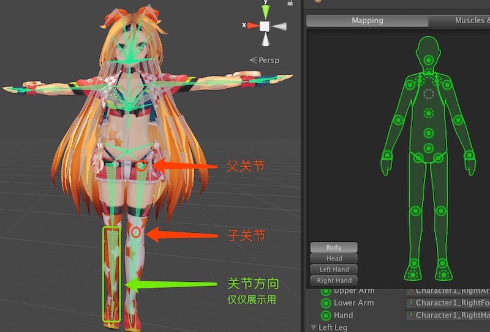

[TOC]

# 一、纹理动画

## 1. 序列帧动画

序列帧动画：

- 依次播放一系列关键帧图片，当播放速度达到一定数值时，看起来就是一个连续的动画
- 多用于游戏 2D 中做循环动作的角色

优点：灵活性强，不需要任何物理计算就可以达到非常细腻的效果

缺点：

- 效果固定，只能从一个角度观看
- 时间较长的序列帧动画会消耗大量的内存和显存，对于移动端来说，会造成一段时间的内存波动

## 2. Sprite 动画

生成 Sprite 序列帧动画的工具：[TexturePacker](https://www.codeandweb.com/texturepacker)

方法：多张序列帧图片合成一张纹理，每个序列帧在纹理中的大小是一样的，通过不断变换对合成纹理的局部采样位置来实现帧动画的切换

优点：多张序列帧图片合成一张纹理，减少纹理的读取次数，提高效率

缺点：

- 效果固定，只能从一个角度观看
- 时间较长的序列帧动画会消耗大量的内存和显存，对于移动端来说，会造成一段时间的内存波动

# 二、顶点动画

## 1. 广告牌

广告牌（Billboarding）根据视角方向旋转一个贴有纹理的多边形（通常是四边形）使得多边形总是面对着摄像机

**应用场景：烟雾，云朵，闪光效果**

和构建相机坐标系的方法类似，需要在广告牌的多边形上构建基坐标系：

1. 在多边形上选取坐标原点（一般为多边形的中心点）
2. 由于一般广告牌的**表面法向量为指向相机的方向**和世界坐标下竖直向上的方向为已知
   从而：设世界坐标下竖直向上的方向为 Y 轴（0，1，0），则垂直于 Y 轴和表面法线构成平面的为 X 轴
   $X = Y_{up} \times Normal$
3. Z 轴在 Y 轴和广告牌表面法线构成的平面内，但 Z 轴不一定是法线，需要重新计算
   Z 轴直于 X 轴和 Y 轴构成的平面 $Z = X \times Y_{up}$
4. 将 X、Y、Z 轴**归一化**后作为广告牌的模型矩阵
5. 根据实际广告牌的中心点在世界坐标系下的位置，将广告牌上的顶点逐个进行位移、MVP 变换，裁剪后绘制到屏幕上

## 2. Morph 动画

记录多个关键动作中的模型所有顶点的位置，通过在运行中对前后的两个关键动作的模型顶点做线性插值，来达到动画的效果

现在多用于人物表情等对动画细节要求较高的地方

## 3. 蒙皮动画

通过骨架在两个姿态间的线性插值变化，来带动绑定在骨架上模型顶点的运动，从而形成动画效果

**骨架：有层次的关节组成的树形结构**

- 关节：包含多种顶点信息的树形结构中的节点
- 关节权重：**属于顶点信息，不存储在关节中**
  顶点存储受哪些关节的影响（Unity 里 1 个顶点最多受 4 个关节的影响）并记录下受每个关节影响的权重
  所有关节的权重和为 1

- 根关节：可以通过平移和旋转根关节移动并确定整个骨架在世界空间中的位置和方向
- 父关节：自身运动可以影响所有子关节的运动
- 子关节：自身运动不会影响父关节

**姿势：关节相对于某坐标系的位置、朝向、缩放**

- 绑定姿势：顶点网格在 <u>绑定骨骼前</u> 默认的姿势
- 局部姿势：关节相对于父关节的偏移，结构 TQS（位置、朝向、缩放）根关节的父节点是世界坐标系原点
- 全局姿势：关节相对于模型空间或者世界空间的姿势

# 引用

- [OpenGEX 官网](http://www.opengex.org/)
- [骨骼动画原理](https://www.cnblogs.com/tandier/p/10087656.html)

